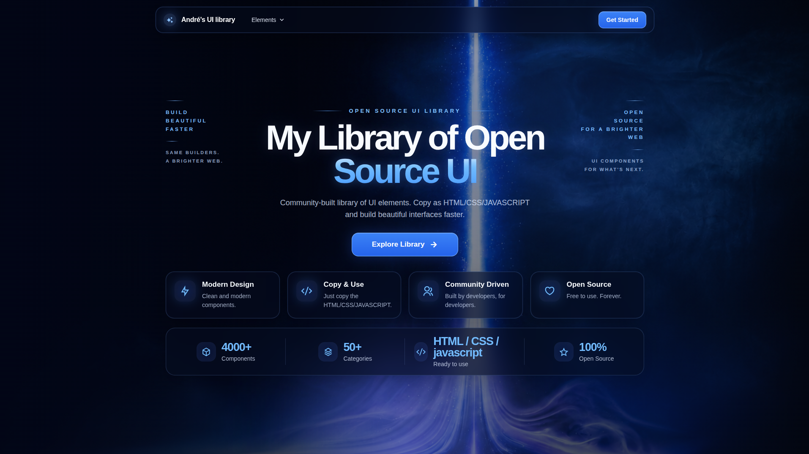
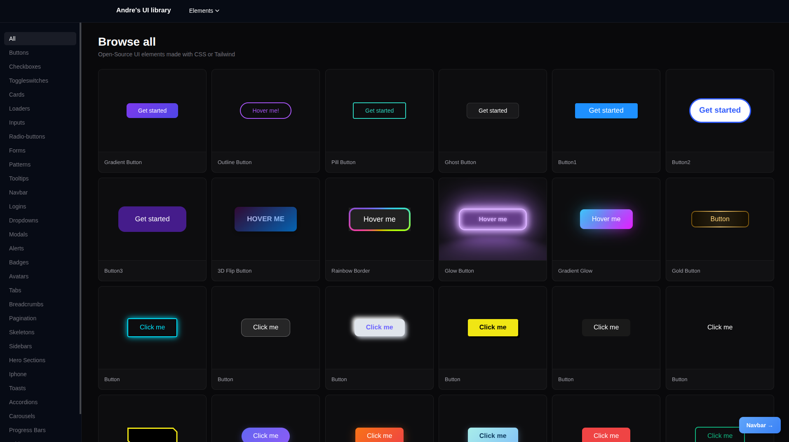
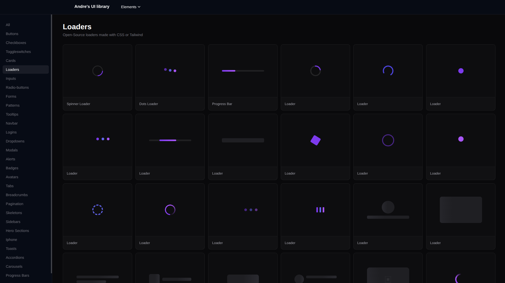

# UI Library

**A modern collection of interactive, reusable and beautifully designed UI components.**

Explore, experiment and discover creative interface elements for modern web development.

[**Live Website ↗**](https://ui-library-website.vercel.app/) · [**GitHub Repository ↗**](https://github.com/itzmitto/ui-library-website)




---

## Overview

**UI Library** is a growing collection of modern UI elements, interactive components and creative web designs.

Built as a personal frontend development project, this library provides a place to explore different interface styles, experiment with animations and discover reusable design patterns.

From simple buttons to advanced interactive components, the library brings a wide range of UI elements together in one organized experience.

### What makes it useful?

- **Interactive Previews** — Explore components and their behavior directly in the browser.
- **Component Variations** — Discover different designs, styles and interactions.
- **Code Examples** — Explore the code behind component designs.
- **Organized Categories** — Find the UI elements you need more easily.
- **Design Inspiration** — Discover new ideas for your next project.
- **Growing Collection** — New designs and improvements can be added over time.

---

## Explore the Components

Browse a collection of UI elements designed for different interfaces and use cases.



### Component Categories

| Interface Elements | Navigation & Layout | Feedback & Interaction |
| ------------------ | ------------------- | ---------------------- |
| Buttons            | Navigation          | Loaders                |
| Inputs             | Sidebars            | Progress Bars          |
| Cards              | Carousels           | Skeletons              |
| Forms              | Pagination          | Overlays               |
| Checkboxes         | Hero Sections       | Accordions             |
| Radio Buttons      | Tables              | Toggles                |
| Avatars            | Advanced Components | Advanced Interactions  |

Each category contains component examples with different visual designs and interaction patterns.

---

## Loading Animations

Explore creative loading indicators, animated effects and visual feedback components.



Loading animations are an important part of interface design, helping communicate progress and improve the overall user experience.

---

## Tech Stack

The project is developed with modern frontend technologies.

| Technology       | Purpose                                |
| ---------------- | -------------------------------------- |
| **React 19**     | Component-based interface development  |
| **TypeScript**   | Type-safe application development      |
| **Vite**         | Fast development and production builds |
| **React Router** | Client-side navigation                 |
| **HTML5**        | Semantic web structure                 |
| **CSS3**         | Styling, layouts and animations        |

---

## Getting Started

Want to explore the project locally? Follow the steps below.

### 1. Clone the repository

```bash
git clone https://github.com/itzmitto/ui-library-website.git
```

### 2. Navigate to the project

```bash
cd ui-library-website
```

### 3. Install dependencies

```bash
npm install
```

### 4. Start the development server

```bash
npm run dev
```

Open the local development URL displayed in your terminal.

### Available Commands

| Command           | Description                  |
| ----------------- | ---------------------------- |
| `npm run dev`     | Start the development server |
| `npm run build`   | Create a production build    |
| `npm run preview` | Preview the production build |
| `npm run lint`    | Run ESLint checks            |

---

## Project Goals

UI Library is an ongoing project focused on frontend development, experimentation and design exploration.

The main goals are to:

- Expand the collection with new UI components.
- Experiment with modern CSS techniques and animations.
- Improve component usability and accessibility.
- Explore creative UI/UX patterns.
- Build a useful reference for future frontend projects.
- Continue improving the overall development experience.

---

## Contributing

Contributions, suggestions and feedback are welcome.

You can participate by reporting bugs, suggesting improvements or submitting pull requests.

Please review the [Code of Conduct](CODE_OF_CONDUCT.md) before contributing.

---

## License

This project is licensed under the **MIT License**, subject to any separate licenses applicable to third-party components.

See the [LICENSE](LICENSE) file for details.

---

## Author

Created and maintained by **[itzmitto](https://github.com/itzmitto)**.

[GitHub Profile](https://github.com/itzmitto) · [View Project](https://github.com/itzmitto/ui-library-website) · [Live Demo](https://ui-library-website.vercel.app/)

---

**UI Library — Explore. Experiment. Create.**

[↑ Back to top](#ui-library)
